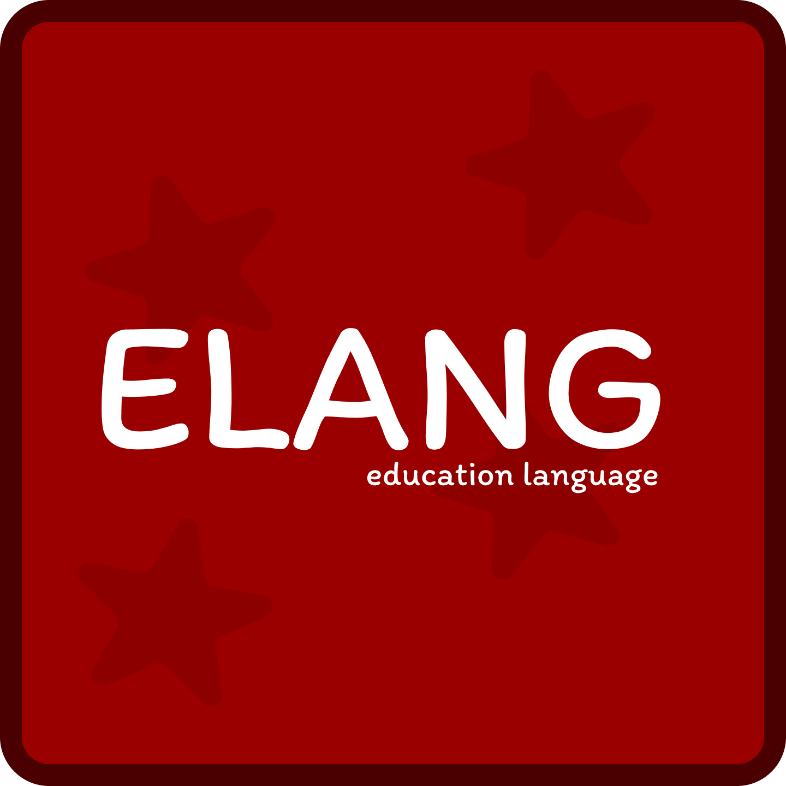

<p align="center"></p>
<h1 align="center">ELANG PROGRAMMING LANGUAGE</h1>
Elang is an interpreted programming language created for educational purposes. This programming language is designed for creating simple scripts and algorithms.

<br><br>

*An example of a simple code in Elang that outputs Hello, world!*
```shell
старт
вывод " Hello, world! "
конец
```

*An example of code that asks the user for their name and displays it*
```shell
старт
пер name = запросить " What's u name? "
вывод $ name
конец
```

<h1 align="center">⭐ PLANS FOR THE FUTURE</h1>
<ul>
    <li>Add English syntax support</li>
    <li>Add conditional statements</li>
    <li>Add OOP</li>
    <li>Add a while loop</li>
</ul>

<h1 align="center">✅ DOWNLOAD INTERPRETATOR</h1>
The programming language is under development. The interpreter will be available for download later.
